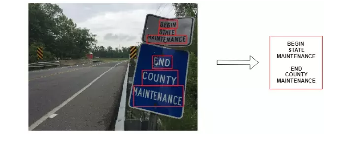
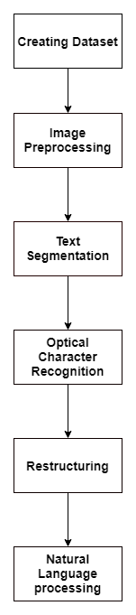
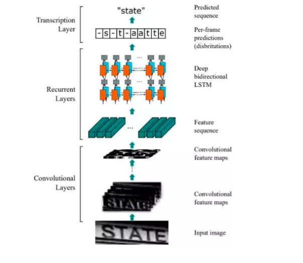
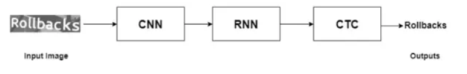
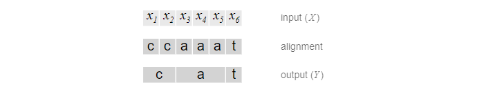
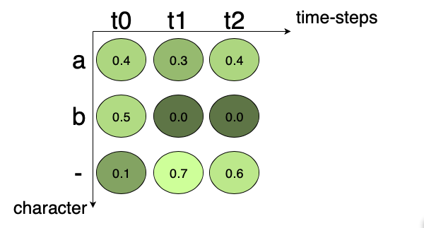
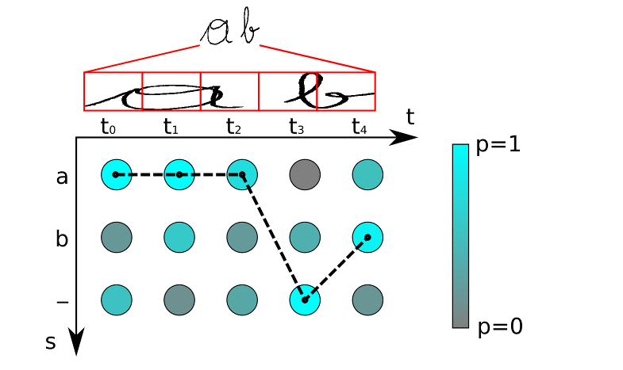

# CRNN và CTCLoss

# OCR Pipeline
Trước tiên chúng ta sẽ cùng trao đổi về một pipeline OCR sử dụng deep learning và computer vision. Optical character recognition là phương pháp chuyển đổi các tài liệu in, viết tay hay những text trong hình ảnh thành các văn bản được số hoá.

Pipeline của OCR

1. Creating Data Set: Đối với bất kì bài toán deep learning nào cũng cần một lượng dữ liệu phong phú , trong bài toán OCR thì chúng ta cần hình ảnh và văn bản tương ứng của chúng
2. Image Preprocessing: Hình ảnh đầu vào cho bài toán OCR có thể từ nhiều nguồn khác nhau. Đôi khi chúng ta cần số hóa một tài liệu được quét, đôi khi chúng ta cần trích xuất văn bản từ các hình ảnh cảnh tự nhiên như biển báo đường phố, hình ảnh từ các cửa hàng, v.v. Những hình ảnh này có thể được xoay, có thể chứa nhiễu, chèn và các vấn đề khác có thể ảnh hưởng đến hệ thống OCR. Để làm cho hệ thống OCR trở nên chính xác hơn, chúng ta cần thực hiện một số xử lý trước hình ảnh có thể được thực hiện bằng OpenCV hoặc bất kỳ thư viện xử lý hình ảnh nào khác.
3. Text segmentation: Hình ảnh đầu vào cho OCR thường chứa rất nhiều từ và dòng, chúng ta cần chuyển các phân đoạn từ hình ảnh này làm đầu vào cho OCR. Các phân đoạn này có thể là từng từ, từng dòng hoặc từng ký tự. Có nhiều thuật toán khác nhau có thể được sử dụng để phân đoạn văn bản như EAST, CTPN, Faster R-CNN, v.v. Chúng ta có thể thay vì 5. Restructuring: Sau quá trình segmentation hoặc detection chúng ta cần restructuring các phần nôi dung đó vào tương ứng với các vị trí ban đầu
6. Natural Language processing: Ví dụ theo yêu cầu của bài toán, chúng ta cần áp dụng các mô hình NLP như RNN hoặc regular expressions trong các văn bản có cấu trúc. Giả sử chúng ta xử lý một tài liệu và cần tìm ra tên và tuổi của một người trong tài liệu đó. Sau đó, chúng ta sẽ sử dụng dữ liệu được gắn thẻ cho tên và tuổi để train mô hình RNN (có thể là một mô hình nhận dạng thực thể tên).segmentation text thì có thể dùng detect text.
4. Optical Character Recognition: Sau quá trình segmentation hoặc detection thì chúng ta sẽ pass đầu ra dự đoán box text vào mô hình text recognition nhận dạng nội dung text.

# Text Recognition
Với sự phát triển của Deep Learning, thì OCR ngày càng chính xác và tốc độ. Về cơ bản thì có 2 thuật toán cơ bản và nổi tiếng được sử dụng cho bài toán nhận dạng là: convolution recurrent neural network (CRNN) với CTCLoss và attentionOCR

# Convolutional Recurrent Neural Network (CRNN)
Nhân dạng kí tự (OCR) về cơ bản là bài toán nhận dạng chuối dựa trên hình ảnh đầu vào và đối với vấn đề nhận dạng trình tự thì RNN là mô hình phù hợp. Còn đối với các vấn đề về hình ảnh thì mạng CNN là phù hợp nhất. 

Các thành phân chính:

1. `Convolution Layers`: Mạng CNN được sử dụng để trích xuất các đặc trưng không gian từ hình ảnh đầu vào.
2. `Recurrent Layers`: Đầu ra từ lớp CNN là các feature map, và được cung cấp cho Recurrent Layers. Recurrent Layers bao gồm deep bidirectional LSTM networks. RNN có khả năng nắm bắt thông tin ngũ cảnh rất tốt trong 1 chuỗi. Đầu ra từ các lớp RNN sẽ bao gồm các giá trị xác suất cho mỗi nhãn tương ứng với mỗi đặc điểm đầu vào. Như vậy, giả sử đầu vào có kích thước là (batch_size, 250) và có 53 labels, thì đầu ra sẽ có kích thước là (batch_size, 250, 53).
3. `Transcription Layer`: Thành phân này sử dụng `Connectionist Temporal Classification` (CTC) để dự đoán đầu ra cho từng time step. 

Đầu ra của RNN sẽ là xác suất của văn bản(từng kí tự). Giả sử chúng ta có hình ảnh đầu vào với text là "good". Đầu ra của RNN là ['g', 'g', 'o', 'o', 'o', 'd', 'd']. Để dữ đoán text đầu ra chúng ta có thể gộp các kí tự giống nhau lại thì kết quả sẽ là "god" và kết quả này hoàn toàn sai so với kết quả ban đầu. CTC giải quyết vấn đề này bằng cách thêm kí tự khoảng trắng ở giữa những kí tự giống nhau liên tục. Và khi decode thì CTC sẽ thoát khỏi những kí tự khoảng trắng và cho ra kết quả "good".

# CTCLoss
CTC đơn giản là một Loss Function được sử dụng để huấn luyện các DNN model. Mục tiêu của nó là tìm ra cách ánh xạ giữa input X và output Y. Nó không yêu cầu dữ liệu được gán nhãn cụ thể cho từng timesteps, bởi vì nó có thể đưa ra xác suất cho mỗi khả năng ánh xạ từ X sang Y. Nó chỉ yêu cầu đầu vào là 1 hình ảnh và đoạn text tương ứng với hình ảnh đó. 

Thực chất, CTC không biết chính xác cách ánh xạ từ X sang Y. Nó làm việc theo kiểu `Word Arround`, tức là nếu cho nó X thì nó sẽ đưa ra tất cả các khả năng của Y, kèm theo xác suất của từng khả năng. Chúng ta phải huấn luyện model sao cho kết quả dự đoán gần giống với ground truth.

Quá trình làm việc của CTC gồm 3 bước:

1. `Encoding Text`: Trường hợp lý tưởng thì mỗi timestep sẽ tương ứng với một ký tự. Tuy nhiên nếu một ký tự tồn tại trong cả 2 timestep thì sao ? Khi đó kết quả sẽ xuất hiện các kí tự cùng nhau. CTC giải quyết các ký tự trùng nhau này bằng cách gộp tất cả các kí tự trùng nhau lại thành một. Ví dụ: "ttiien ssuu" -> "tien su".
Tuy nhiên làm như vậy thì những từ có các kí tự trùng nhau ví dụ: "hello", "sorry", ... Để xử lí vấn đề này CTC sử dụng một kí tự giả gọi là `blank` và ký hiệu là '-'. Trong khi mã hoá text, nếu gặp 2 kí tự trùng nhau, CTC sẽ chèn thêm kí tự blank vào giữa chúng. Ví dụ: "meet" -> "mm-ee-ee-t", "mmm-e-ee-tt". Trong quá trình decode, nếu gặp kí tự blank này thì CTC hiểu rằng phải giữ lại cả 2 kí tự 2 bên kí hiệu đó. 

2. `Loss Calculate`: Loss được tính cho mỗi `training sample`(một cặp ảnh và GT text tương ứng). Nó là tổng tất cả các `scores` của tất cả các khả năng ánh xạ của GT text. Giả sử chúng ta có một ma trận `scores` là output của CRNN như sau:

Ma trận này gồm 2 timesteps và GT text có 3 kí tự: "a", "b", blank(-). Tổng `scores` của mỗi timestep bằng 1. Giả sử:

+ Các khả năng ánh xạ của kí tự `a` là: `aaa`, `a--`, `a-`, `aa-`, `-aa`, `--a`. Score của a = 0.4x0.3x0.4 + 0.4x0.7x0.6 + 0.4x0.7 + 0.4x0.3x0.6 + 0.1x0.3x0.4 + 0.1x0.7x0.4 = 0.608.
Loss  = $-log_{10}0.6084 = 0.216$
+ Các khả năng ánh xạ của kí tự `b` là: `bbb`, `b--`, `b-`, `bb-`, `-bb`, `--b`. Score của a =0.5x0.0x0.0 + 0.5x0.7x0.6 + 0.5x0.7 + 0.5x0.0x0.6 + 0.1x0.0x0.0 + 0.1x0.7x0.0 = 0.56
Loss  = $-log_{10}0.56 = 0.25$
+ Các khả năng ánh xạ của blank là: `---`, `--`. Score của blank = 0.1x0.7 + 0.1x0.7x0.6 = 0.112. Loss = $-log_{10}0.112 = 0.95$
Tổng Loss = 0.216 + 0.25 + 0.95 = 1.416. Chúng ta cần tối thiểu hoá giá trị Loss này trong quá trình huấn luyện model.
3. `Decoding Text`: Quá trình decoding của một unseen image diễn ra như sau: 
+ Tìm đường đi tối ưu từ score matrix bằng cách chọn các kí tự có score cao nhất ở mỗi timestep.
+ Xoá bỏ các kí tự trống và kí tự trùng nhau.

Có 3 ký tự là a. b, - và 5 TimeSteps. Các ký tự trên đường đi tối ưu nhất là: aaa-b. Sau khi loại bỏ ký tự trùng và khoảng trắng ta được ab.

